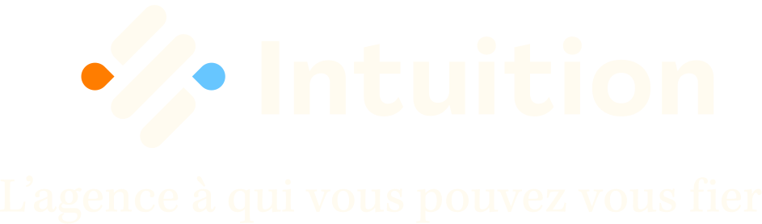

<link rel="preconnect" href="https://fonts.googleapis.com">
<link rel="preconnect" href="https://fonts.gstatic.com" crossorigin>
<link href="https://fonts.googleapis.com/css2?family=Montserrat:wght@400;500;600;700&display=swap" rel="stylesheet">

<h1 align="center">
    <a href="http://github.com/LucasMadranges" class="gradient-purple">
        Lucas Madranges
    </a>
</h1>
<h2 align="center">
    
        Student in web development
    
</h2>
<h3 align="center">
    <a href="https://www.mydigitalschool.com">
        
        MyDigitalSchool
    </a> 
    & 
    <a href="https://www.agence-intuition.fr">
        Agence Intuition
        
    </a>
</h3>
<!--
- 🔭 I’m currently working on ...
- 🌱 I’m currently learning ...
- 👯 I’m looking to collaborate on ...
- 🤔 I’m looking for help with ...
- 💬 Ask me about ...
- 📫 How to reach me: ...
- 😄 Pronouns: ...
- ⚡ Fun fact: ...
-->
