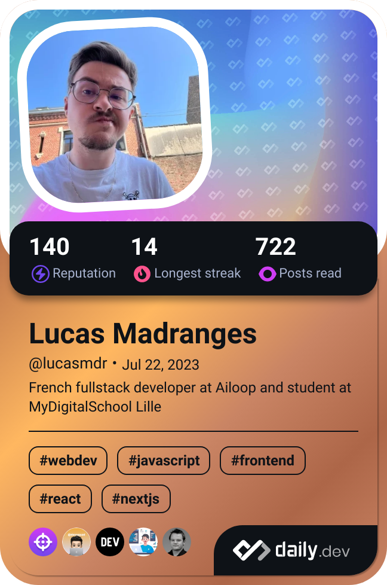

<h1 align="center">💫 About Me 💫</h1>

    Hi developers 👋 
     
    I'm Lucas Madranges, I'm 22 and I'm french from Lille 🇫🇷
     
     
    🏫 I'm currently taking a professional title on fullstack development at higher school <a href="https://www.mydigitalschool.com/">MyDigitalSchool</a>
     
    💻 I'm currently in an internship of fullstack developer at <a href="https://www.ailoop.io/">Ailoop</a> 
     
    🎓 I'm graduated of an Advanced Technician's Certificate (BTS in french) and a professional title of Application Developer Designer (Concepteur Développeur d'Applications in french)
     
    ❤️ I love writing code on everything and learn about new languages, technology and frameworks
     
    📫 If you want to reach me : <a href="mailto:lucas.madranges.pro@icloud.com">lucas.madranges.pro@icloud.com</a>

<h2 align="center">🌐 My Social Link 🌐</h2>

<h2>🔥 My Stack 🔥</h2>

<h3 align="center">🌝 Front-end</h3>

<h3 align="center">🌚 Back-end</h3>

<h3 align="center">📱 Mobile</h3>

<h3 align="center">🧪 Tests</h3>

<h3 align="center">🛠️ Tools</h3>

<h2 align="center">📊 My GitHub Stats 📊</h2>

<table style="border-collapse: collapse; width: 100%;">
  <tr style="border: none;">
    <td align="center" width="50%">
        
    </td>
    <td align="center" width="50%">
        
    </td>
  </tr>
  <tr>
    <td align="center" width="50%">
        
    </td>
    <td align="center" width="50%">
        
        
    </td>
  </tr>
  <tr>
    <td colspan="2" align="center" width="50%">
        
    </td>
  </tr>
</table>